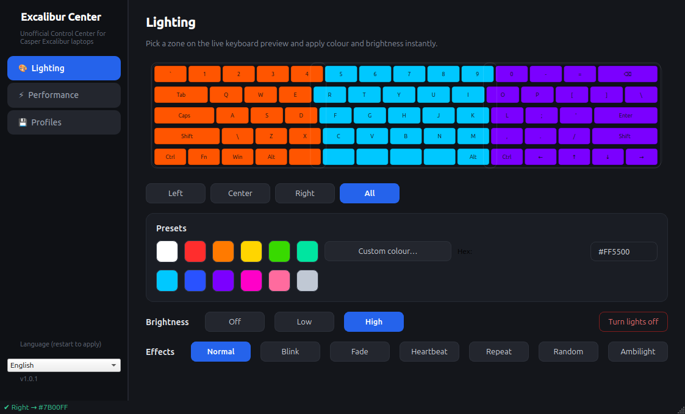
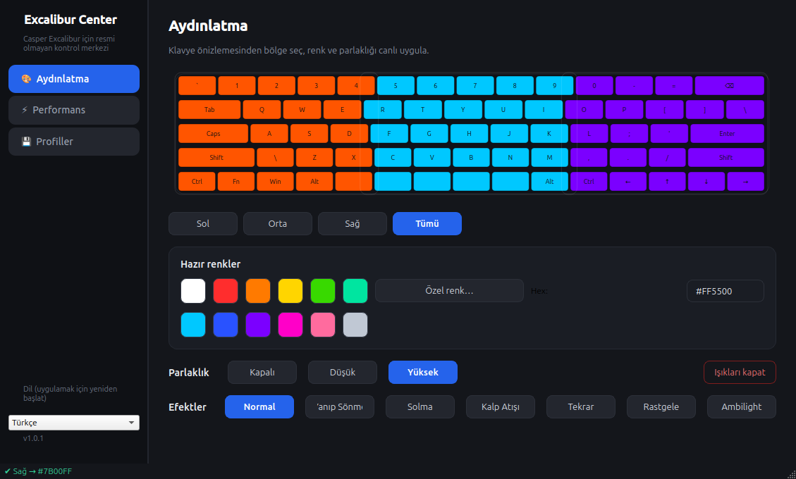

# Excalibur Center

**Casper Excalibur dizüstü bilgisayarlar için resmi olmayan kontrol merkezi** — klavye RGB aydınlatması, güç planları ve fan izleme, tek bir uygulamada.

> Casper Excalibur G770 üzerinde geliştirildi ve test edildi; diğer Excalibur modelleriyle de çalışması beklenir (aşağıdaki *Destek* bölümüne bak).

 

## Özellikler

- 🎨 **Aydınlatma**: canlı klavye önizlemesi üzerinden 3 bölgeye (sol/orta/sağ) ayrı ayrı renk atama, hazır palet + özel renk + hex girişi, 3 kademeli parlaklık, tek tuşla aç/kapat
- ⚡ **Performans**: Windows'taki Control Center'daki gibi güç planları (Yüksek Güç / Oyun / Metin / Düşük Güç), CPU & GPU fan hızlarının canlı takibi
- 💾 **Profiller**: sık kullandığın kombinasyonları kaydet; açılışta son durum systemd servisiyle otomatik geri yüklenir
- 🌍 **Çok dilli**: İngilizce (varsayılan) ve Türkçe — kenar çubuğundan dil seçimi veya `excalibur-center --lang tr`
- 🔒 **Güvenlik modeli**: uygulama asla root çalışmaz — udev kuralıyla `video` grubuna şifresiz erişim verilir; o da olmazsa Polkit + doğrulamalı helper devreye girer
- 🖥️ **CLI**: betiklerde ve kısayollarda kullanım için tam işlevsel komut satırı arayüzü

## Kurulum

### Tek satır (önerilen)

Depoyu klonlamaya gerek yok:

```bash
curl -fsSL https://raw.githubusercontent.com/salihozkara/excalibur-center/master/install.sh | bash
```

Betik kaynak kodu otomatik indirir, bağımlılıkları kurar, `casper-wmi`
çekirdek modülünü DKMS ile derler ve her şeyi yapılandırır.

### Depodan

```bash
git clone https://github.com/salihozkara/excalibur-center.git
cd excalibur-center
./install.sh
```

Betik ne yapar?

1. `python3-pyqt6`, `dkms`, `build-essential` ve çekirdek başlıklarını kurar
2. `casper-wmi` çekirdek modülünü DKMS ile derler/yükler (her çekirdek güncellemesinde otomatik yeniden derlenir)
3. Uygulamayı `/opt/excalibur-center` altına kurar, menü kısayolu oluşturur
4. Açılışta renk geri yükleme servisini etkinleştirir

Kaldırmak için:

```bash
curl -fsSL https://raw.githubusercontent.com/salihozkara/excalibur-center/master/uninstall.sh | bash
```

### Arch / AUR

Sürücü, Arch Linux kullanıcıları için AUR üzerindeki benzer paketlerle de uyumludur; bu depo Debian tabanlı dağıtımlara odaklanır.

## Kullanım

```bash
excalibur-center                # GUI'yi başlat
excalibur-center --status       # mevcut durumu yazdır
excalibur-center --set-led all FF8800 2   # tüm bölgelere turuncu, parlaklık 2
excalibur-center --set-led left 00FF88     # sol bölgeye yeşil
excalibur-center --set-plan oyun           # güç planı değiştir
excalibur-center --restore                 # son durumu geri yükle (systemd kullanır)
```

## Desteklenen donanım

Sürücü, Casper Excalibur dizüstülerde ortak olan WMI GUID'ine (`644C5791-B7B0-4123-A90B-E93876E0DAAD`) bağlanır.

| Model | LED | Fan | Güç planı |
|---|---|---|---|
| G650 / G670 / G750 | ✅ | ✅ | ✅ |
| **G770** | ✅ (test edildi) | ✅ (bu fork ile) | ✅ (bu fork ile) |
| G900 | ✅ | ✅ (CP131 BIOS) | ✅ |

Bu fork'un upstream sürücüye göre farkları için [CHANGELOG.md](CHANGELOG.md) dosyasına bak.

## Sorun giderme

**Işıklar hiç yanmıyor**
```bash
sudo modprobe casper_wmi
ls /sys/class/leds/casper::kbd_backlight/led_control   # var mı?
echo "60200FF00" | sudo tee /sys/class/leds/casper::kbd_backlight/led_control   # yeşil test
```

**GUI "izin yok" diyor**: `groups` çıktısında `video` yoksa çıkış yapıp tekrar gir (kurulum seni gruba ekler).

**Fan hızları tuhaf görünüyor**: Model listesindeki bayt sırası varsayımı farklı olabilir — bir issue aç, modelini (`sudo dmidecode -t system`) ekleyerek bildir.

## Katkıda bulunma

PR'lar memnuniyetle karşılanır! Özellikle:
- Farklı Excalibur modellerinde test raporları (LED/fan/güç planı çalışıyor mu?)
- Fan bayt sırası doğrulamaları
- Çeviri (TR/EN dışındaki diller)

```bash
pip install -e .        # geliştirme kipi
python -m pytest tests/ # testler
QT_QPA_PLATFORM=offscreen python -m excalibur_center.cli --status
```

## Lisans

- Sürücü (`driver/`): GPL-2.0-or-later — [casper-wmi](https://github.com/Mustafa-eksi/casper-wmi) projesinin forkudur; lisans ve telif bilgileri `driver/casper-wmi.c` başlığında korunur
- Uygulama: GPL-2.0-or-later

Casper ile resmi bir bağlantımız yoktur. Tüm ticari markalar sahiplerine aittir.
